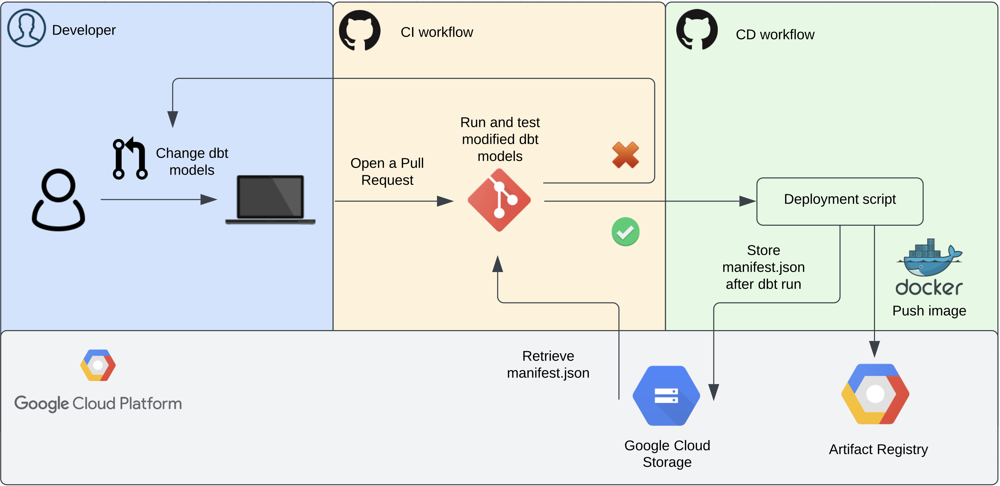

Dbt is a great tool for data transformations. The paid version, called dbt Cloud, offers [Slim CI](https://docs.getdbt.com/docs/dbt-cloud/using-dbt-cloud/cloud-enabling-continuous-integration). Slim CI makes it easy to test new and modified dbt models before deploying them into production. You can configure jobs to run when opening a Pull Request in your repository. By surfacing the job’s most recent successful run artifacts, **dbt Cloud** determines the set of new and modified resources. You can choose to only run the dbt models for which any code has changed. This makes your CI process more efficient in terms of time and costs. In this article I will explain how to mimic this functionality when you are limited to using **dbt Core**.

Summarized, the process is as follows:

* Run dbt when deploying to production and save the manifest.json file to cloud storage. This file contains the **state of the models** of the last dbt run, and thus reflects the models deployed to production.

* Retrieve the manifest.json file from cloud storage when opening a new **pull request** and run dbt using the `state:modified+` parameter in that same pull request.



## Storing the manifest.json file

First, you need to create a cloud storage folder, which you can do through the UI, but preferably through Terraform. I am using Google Cloud Storage (GCS), but you can use any cloud storage. The manifest.json file will be copied to this folder, and overwritten each time a new deployment is made. I named my GCS bucket manifest-location-prod, and can access it at gs://manifest-location-prod when logging in to that Google Cloud project during the CI process. I was already generating the manifest.json file in a workflow where we publish our dbt documentation to Github Pages, so I incorporate the copying of the manifest.json file to the GCS bucket in that workflow. Find a full example of this Github workflow in [this](https://github.com/bjornvandijkman1993/dbt-slim-ci) repository, or see the relevant snippet below.
>  Note: you first need to run dbt before generating the documentation, because this ensures that you see documentation for all columns, and not just the columns described in your dbt yml files.

```yaml

- name: Install dbt dependencies
  run: dbt deps --target dev

# this step is necessary in order to get the right information into
# the documentation
- name: Run dbt
  run: dbt run --target prod --profiles-dir .

# docs are generated and stored in the dbt/public folder within
# the github runner
- name: Build docs
  run: |
    dbt docs generate --target prod --profiles-dir .
- name: Copy docs
  run: |
    mkdir -p public
    mv docs/index.html public/
    mv docs/catalog.json public/
    mv docs/manifest.json public/
    mv docs/run_results.json public/
# the manifest.json file is stored in cloud storage and reflects the current state
# of the production environment. When a new pull request is opened,
# pr-dbt.yml is triggered which retrieves the manifest.json file.
# This file is then used to know which models are already being run
# in production and which ones are new (and should be run/tested)
- name: Copy manifest file to gcs bucket
  run: |
    gsutil cp ./public/manifest.json gs://manifest-location-prod
# publishes our dbt documentation
- name: Publish 🚀
  uses: peaceiris/actions-gh-pages@v3
  with:
    github_token: ${{ secrets.GITHUB_TOKEN }}
    publish_dir: dbt/public
    publish_branch: gh-pages
    commit_message: ${{ needs.setup.outputs.checkout_ref }}
```

## Slim CI

When opening a pull request we use that same manifest.json file to get the **current state of the deployed models**. After retrieving the file from GCS, the new or modified dbt models are run and tested. The parameter state:modified+ is used to run these models and its first order children, which are the models that are downstream of the modified models.

```yaml
# this gets the manifest file from google cloud storage. This file
# contains information on the models that are currently deployed in
# production and is updated whenever the manual-dbt-docs workflow
# is triggered, which is every time a release is triggered
- name: Get manifest file
  run: gsutil cp gs://manifest-location-prod/manifest.json manifest.json

- name: Install dbt dependencies
  run: dbt deps --target dev --profiles-dir .

- name: Debug dbt
  run: dbt debug --target dev --profiles-dir .

# only want to run dbt models that are modified
- name: Run modified dbt models and its first-order children
  run: dbt run --target dev --profiles-dir . --select state:modified+ --state ./

- name: Run modified dbt tests
  run: dbt test --target dev --profiles-dir . --select state:modified --state ./
```

## Limit the data

Testing these new models during Pull Requests against full production datasets would be expensive. Limit the amount of data against which the models are tested by using **dbt macros**. This allows you to test models on a subset of the production data. The macro in days_back.sql uses a date column as input. The objective is to limit the data, x number of days back from today.

```sql


    extract(date from {{ column }}) >= date_sub(current_date("Europe/Amsterdam"), interval {{ days }} day)

    {{ column }} >= date_sub(current_date("Europe/Amsterdam"), interval {{ days }} day)


```

In our staging model stg_web.sql, we call the macro with the arguments that we want data from the last 3 days, and specify the column from which to extract the dates. Using 3 as an input for days, date_sub(current_date("Europe/Amsterdam"), interval {{ days }} day) from days_back.sql will return the date from 3 days ago. The macro then filters on the dates that are greater or equal than the returned date. Do note that your source table has to be partitioned on the date column to optimize the query for cost.

```sql
select
    id,
    logged_in,
    date
from
    {{ source('web_data', 'transactions') }}

where
    {{ days_back(days=3, column="date") }}

```

This is all conditional on the name of the target, because we do not want to filter the data when targeting “prod”. In the Pull Request workflow “dev” is being targeted, which means that the days_back macro is only used when integrating new dbt models.

## Conclusion

Testing and running new or modified dbt models is important, but the costs and time that it takes can get out of hand very quickly. By mimicking the Slim CI feature of dbt Cloud and filtering the data against which the dbt models are run, we can make our CI process more (cost) efficient.

Thanks for reading! Feel free to reach out if you found this post interesting or if it helped you out in any way.


