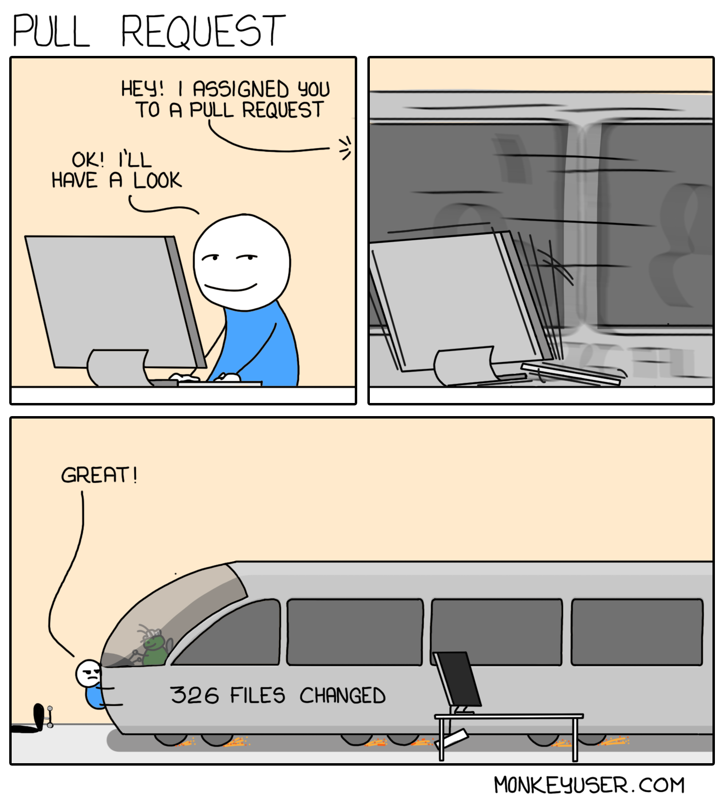

### Using a pull request template, labeler and a semantics file

You have worked hard on a new feature or on a bug, and it is time to open a pull request to notify your team members that the feature or fix that you worked on, is ready. It's the reviewers job to review your code and thoroughly discuss the implementation of a feature before approving the merge to main. But what about a closer look at the pull request itself? Are there any standards or best practices that we should care about?

### Should you care?

The answer to this is YES! And the reasons why are discussed in [this](https://hugooodias.medium.com/the-anatomy-of-a-perfect-pull-request-567382bb6067) excellent blog post by Hugo Dias. A pull request should be able to be reviewed easily and quickly. To facilitate this, the following actionable insights were shared:

* A pull request should give details on **what** was changed, **why** it was changed and **how** it was changed
* A pull request should be **small.** A pull request with more than 250 lines of code tends to take more than 1 hour to be reviewed
* The title should be **self-explanatory**, describing what the pull request does




### Learning by enforcing

We could rely on our team members to have read that article and comply with the best practices that you discussed during a team meeting, or you could help them out a little bit using the following features in Github:

* A pull request template
* A labeler.yml file to automatically assign labels to your pull requests
* A `semantic.yml` file that validates the title of the pull request
* And as a bonus, a CODEOWNERS file that automatically assigns a reviewer to a pull request

My repository with the code for this tutorial can be found [here](https://github.com/bjornvandijkman1993/pull-request-automation).

### Pull Request template

You can put a pull_request_template.md file with your desired template in your .github folder to automatically include the template’s contents in the pull request body. If you want to have your team members explain **what** was changed in the code, **why** it was changed and **how** it changed you could do something like:

```markdown
### Description
What:

How:

Link to Jira Ticket: 

---

### Code Checklist
- [ ] tested
- [ ] documented
```
The body shown above will automatically be included when a pull request is opened. Why the code was changed should ideally be explained in a Jira (or any other) ticket. Linking to the relevant issue is helpful in explaining why you wrote this code and opened this pull request.

### Labeler

A labeler.yml file is used to automatically assign labels to pull requests. A label can be assigned based on:

* the number of lines of code changed in the pull request
* the subdirectory in which the code was changed

I included the following workflow in .github/workflows/pr-labeler.yml:

```yaml

name: Pull Request Labeling

on:
  - pull_request

jobs:
  triage:
    runs-on: ubuntu-latest
    steps:
      - uses: actions/labeler@v3
        with:
          repo-token: "${{ secrets.GITHUB_TOKEN }}"

  size-label:
    runs-on: ubuntu-latest
    steps:
      - name: size-label
        uses: "pascalgn/size-label-action@v0.4.3"
        env:
          GITHUB_TOKEN: "${{ secrets.GITHUB_TOKEN }}"
        with:
          sizes: >
            {
              "0": "XS",
              "20": "S",
              "50": "M",
              "250": "Too Large"
            }
```

Pull requests that contain more than 250 lines will be labeled as Too Large, because nobody got time for that. You can assign labels based on the subdirectory in which the code was changed in the following file .github/labeler.yml :

```yaml
ci/cd:
  - .github/workflows/*

infrastructure:
  - terraform/**

documentation:
  - README.md
  - ./*.md

orchestration:
  - airflow/**

transformations:
  - dbt/**

data-quality:
  - soda/**
  - great-expectations/**
  - great-expectations-documentation/**
```

Any changes that were made in .github/workflows will be labeled as ci/cd, and all markdown files will be labeled as documentation. Opening a pull request for some changes that I made in pr-labeler.yml now looks like this:


The pull request template is included, along with a label of the size (XS) and the label for the directory in which a change was made (ci/cd).

### A semantic title

I started the title of the pull request with feat:, indicating that the contents of the pull request can best be characterized as a new feature. This follows the [convention](https://www.conventionalcommits.org/en/v1.0.0/) used on top of commit messages:

 1. fix: a pull request of *type *fix patches a bug in your codebase
 2. feat: a pull request of *type* feat introduces a new feature into the codebase
 3. types other than fix: and feat: are allowed as well, including build:, chore:, ci:, docs:, style:, refactor:, perf:, test:, and others.

To enforce these semantics, include a semantic.yml file in .github/. This file looks as follows:

```yaml
# Always validate the PR title, and ignore the commits
titleOnly: true
# By default types specified in commitizen/conventional-commit-types is used.
# See: https://github.com/commitizen/conventional-commit-types/blob/v3.0.0/index.json
# You can override the valid types
types:
  - feat
  - fix
  - docs
  - style
  - refactor
  - perf
  - test
  - build
  - ci
  - chore
  - revert
```

You also need to install the [semantic pull request application](https://github.com/marketplace/semantic-pull-requests) from the GitHub Marketplace (it’s free!). After having merged the semantics file to your main branch and opening a new pull request without one of these prefixes, it will throw an error.


Changing the title of the pull request into a semantic one lets all checks pass, it is now ready to be merged!


### Bonus trick

Besides assigning labels to a pull request based on the contents, it is also possible to automatically assign reviewers using a CODEOWNERS file. You can use this file to define individuals or teams that are responsible for certain parts of the code in that repository. Just as the other files, the CODEOWNERS file can be put in the .github/ directory. A reviewer can be assigned based on the extension or the directory of a file. Lets add another Github account of mine as a codeowner for the .github directory:

```yaml
/.github @bjornvandijkman-ingka
```

Opening a pull request that includes a change in the .github directory automatically assigns bjornvandijkman-ingka as a reviewer:


### Recap

A good pull request should:

* give details on what was changed, why it changed and how it was changed → use a pull_request_template to give some guidance on this

* be small → automatically assign size labels to the pull request using Github actions

* The title should be **self-explanatory**, describing what the pull request does → use conventional commit semantics to describe the contents of the pull request

* Lastly, you can use a CODEOWNERS file to automatically assign reviewers to a pull request.


Of course these tools only nudge the creator of the pull request into a certain direction. It is still the responsibility of the individual and the team to follow the best practices. You can temporarily put a link to the article of Hugo Dias in your pull request template to make sure that everyone reads it.

Thanks for reading! Feel free to follow me on [LinkedIn](https://www.linkedin.com/in/björn-van-dijkman-5103a671/) if you are, like me, passionate about data science and the engineering side of it.

__________________________________________________________________

Links:

- https://hugooodias.medium.com/the-anatomy-of-a-perfect-pull-request-567382bb6067
- https://www.conventionalcommits.org/en/v1.0.0/
- https://github.com/marketplace/semantic-pull-requests
